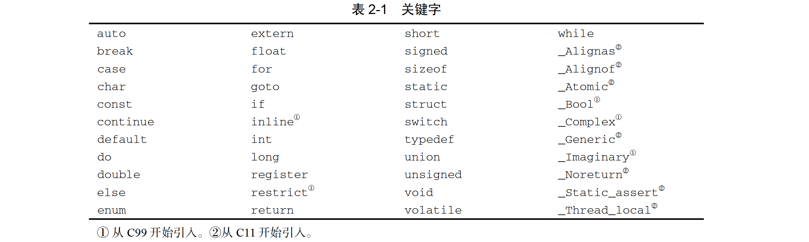

# 第 1 章  C 语言概述

## 1.1 C 语言的历史

### 1.1.1 起源

C语言是贝尔实验室的 Ken Thompson、Dennis Ritchie等人开发的 UNIX操作系统的“副产品”。

K&R $\to$ Algol 60语言 $\to$ BCPL 语言 $\to$ B语言 $\to$ NB语言（意为“New B”）$\to$ C语言。

### 1.1.2 标准化

C89或C90 $\to$ C99 $\to$ C11 $\to$ C18。

### 1.1.3 基于 C 的语言

C语言对现代编程语言有着巨大的影响，许多现代编程语言都借鉴了大量 C语言的特性。

- C++：包括了所有C特性，但增加了类和其他特性以支持面向对象编程。
- Java：基于 C++，因此也继承了 C的许多特性。 
- C#：由 C++和 Java发展起来的一种较新的语言。 
- Perl：最初是一种非常简单的脚本语言，在发展过程中采用了C的许多特性。

## 1.2 C 语言的优缺点

- C语言是一种底层语言。

  提供了对机器级概念（例如，字节和地址）的访问；
  提供了与计算机内置指令紧密协调的操作，使得程序可以快速执行。

- C语言是一种小型语言。

-  C语言是一种包容性语言。

  提供了比其他许多语言更高的自由度；
  C语言不像其他语言那样强制进行详细的错误检查。

### 1.2.1 C 语言的优点

- 高效。
- 可移植。
- 功能强大。
- 灵活。
- 标准库。
- 与UNIX系统的集成。

### 1.2.2 C 语言的缺点

- C 程序更容易隐藏错误。
- C 程序可能会难以理解。
- C 程序可能会难以修改。

### 1.2.3 高效地使用 C 语言

- 学习如何规避 C 语言的缺陷。
- 使用软件工具使程序更加可靠。
- 利用现有的代码库。
- 采用一套切合实际的编码规范。
-  避免“投机取巧”和极度复杂的代码。
- 紧贴标准。

### 问与答  

# 第 2 章  C 语言基本概念

## 2.1 编写一个简单的 C 程序

### 2.1.1 编译和链接

对于 C 程序来说，转化通常包含下列 3 个步骤。

- **预处理**。首先程序会被交给预处理器（preprocessor）。
  预处理器执行以 # 开头的命令（通常称为指令）。
- **编译**。
  编译器（compiler）会把程序翻译成机器指令（即目标代码）。
- **链接**。
  在最后一个步骤中，链接器（linker）把由编译器产生的目标代码和所需的其他附 加代码整合在一起，这样才最终产生了完全可执行的程序。这些附加代码包括程序中用到的库函数（如printf函数）。 

### 2.1.2 集成开发环境

**集成开发环境**（integrated development environment, IDE）来编译。集成开发环境是一个软件包，我们可以在其中编辑、编译、链接、执行甚至调试程序。

## 2.2 简单程序的一般形式

简单的 C程 序一般具有如下形式：

``` C
指令
int main(void) 
{
	语句
}
```

C 语言使用{和}的方式非常类似于 其他语言中 begin 和 end 的用法。

C 语言极其依赖缩 写词和特殊符号，这是 C 程序非常简洁（或者不客气地说含义模糊）的一个原因。

### 2.2.1 指令

**指令**：把预处理器执行的命令。所有指令都是以字符#开始的。
指令默认只占一行，每条指令的结尾没有分号或其他特殊标记。

**头**：C 语言拥有大量类似于<stdio.h>的头（header， 15.2 节），每个头都包含 一些标准库的内容。

### 2.2.2 函数

**函数**：类似于其他编程语言中的“过程”或“子例程”，它们是用来构建程序的构建块。

C 程序就是函数的集合。

函数分为两大类：一类是程序员编写的函数，另一类则是作为 C 语言实现的一部分提供的函数。我们把后者称为库函数（library function），因为它们属于一个 由编译器提供的函数“库”。

在 C 语言中，函数仅仅是一系列组合在一起并且被赋予了名字的语句。

一个 C 程序可以包含多个函数，但只有main 函数是必须有的。main 函数是非常特殊的： 在执行程序时系统会自动调用 main 函数。

### 2.2.3 语句

**语句**：程序运行时执行的命令。

C 语言规定每条语句都要以分号结尾。（复合语句就不以分号结尾。）

指令通常只占一行，因此不需要用分号结尾。

### 2.2.4 显示字符串

**字面串**（string literal）—— 用一对双引号包围的一系列字符。

写换行符就意味着终止当前行，然后把后续的输出转到下一行。

## 2.3 注释

某些重要内容：文档说明。每一个程序都应该包含识别信息， 即程序名、编写日期、作者、程序的用途以及其他相关信息。C 语言把这类信息放在注释
（comment）中。符号 /\*标记注释的开始，符号 \*/ 标记注释的结束。

注释几乎可以出现在程序的任何位置上。它既可以独占一行，也可以和其他程序文本出现在同一行中。

注释还可以占用多行。如果遇到符号 /\*，那么编译器读入（并且忽略）随后的内容直到遇到符号 \*/ 为止。
单独把*/符号放在一行可以提高程序的易读性。

C99提供了另一种类型的注释，以//（两个相邻的斜杠）开始。这种风格的注释会在行末自动终止。

## 2.4 变量和赋值

 C语言中的这类存储临时数据的单元被称为**变量**（variable）。

### 2.4.1 类型

每一个变量都必须有一个**类型**（type）。类型用来说明变量所存储的数据的种类。

数值型变量的类型决定了变量所能存储的最大值和最小值，同时也决定了是否允许在小数点后出现数字。

### 2.4.2 声明

在使用变量之前必须对其进行**声明**（为编译器所做的描述）。为了声明变量，首先要指定变量的`类型`，然后说明变量的`名字`。

如果几个变量具有相同的类型，就可以把它们的声明合并：

``` c
	int height, length, width, volume; 
	float profit, loss;
```

注意每一条完整的声明都要以分号结尾。

### 2.4.3 赋值 

变量通过**赋值**（assignment）的方式获得值。

赋给 float 型变量的常量通常带小数点。

当我们把一个包含小数点的常量赋值给 float 型变量时，最好在该常量后面加一个字母 f（代表 float）。

通常情况下，赋值运算的右侧可以是 一个含有常量、变量和运算符的公式（在 C 语言的术语中称为**表达式**）。

### 2.4.4 显示变量的值

如果要强制%f 显示小数点后 p位数字，可以把.p放置在%和 f 之 间。

``` C
	printf("Profit: $%.2f\n", profit);
```

### 2.4.5 初始化

没有默认值并且尚未在程序中被赋值的变量是**未初始化的**（uninitialized）。

### 2.4.6 显示表达式的值

 C 语言的一个通用原则：在任何需要数值的地方，都可以使用具有相同类型的表达式。

``` C
	volume = height * length * width; 
	printf("%d\n", volume);
	// 形式代替
	printf("%d\n", height * length * width);
```

## 2.5 读入输入

scanf 函数和 printf 函数都需要使用**格式串**（format string）来指定输入数据或输出数据的形式。

scanf 函数需要知道将获得的输入数据的格式，而printf函数需要知道输出数据的显示格式。 

## 2.6 定义常量的名字

**宏定义**（macro definition）的特性给常量命名。

预处理器会把每一个宏替换为其表示的值。

还可以利用宏来定义表达式：

``` C
#define RECIPROCAL_OF_PI (1.0f / 3.14159f)
```

宏的名字只用了大写字母。

## 2.7 标识符

需要对变量、函数、宏和其他实体进行命名。这些名字称为**标识符**（identifier）。在 C 语言中，标识符可以含有字母、数字和下划线，但是必须以字母或者下划线开头。

C 语言是**区分大小写**的；也就是说，在标识符中 C 语言区分大写字母和小写字母。

### 关键字



## 2.8 C 程序的书写规范


可以把 C 程序看成一连串**记号（**token），即许多在不改变意思的情况上无法再分割的字符组。标识符和关键字都是记号。像+和-这样的运算符、逗号和分号这样的标点符号以及字面串，也都是记号。

- 语句可以分开放在任意多行内。
- 记号间的空格使我们更容易区分记号。
- 缩进有助于轻松识别程序嵌套。
- 空行可以把程序划分成逻辑单元，从而使读者更容易辨别程序的结构。


问与答
练习题
编程题
第 3 章  格式化输入/输出  28
3.1 printf 函数  28
3.1.1 转换说明  29
3.1.2 转义序列  31
3.2 scanf 函数  31 
3.2.1 scanf 函数的工作方法  32 
3.2.2 格式串中的普通字符  34
3.2.3 易混淆的 printf函数和
scanf 函数  
34 问与答  35
练习题  37
编程题  38
第 4 章  表达式  40
4.1 算术运算符  40
4.2 赋值运算符  44
4.2.1 简单赋值  44
4.2.2 左值  45
4.2.3 复合赋值  45
4.3 自增运算符和自减运算符  46
4.4 表达式求值  47
4.5 表达式语句  50
问与答  50
练习题  52
编程题  54
第 5 章  选择语句  56
5.1 逻辑表达式  56
5.1.1 关系运算符  56
5.1.2 判等运算符  57
5.1.3 逻辑运算符  57
5.2 if 语句  58 
5.2.1 复合语句  59
5.2.2 else 子句  59 
5.2.3 级联式 if 语句  61 
5.2.4 “悬空 else”的问题  63 
5.2.5 条件表达式  63
5.2.6 C89 中的布尔值  64
5.2.7 C99 中的布尔值  65
5.3 switch 语句  66 
问与答  69
练习题  72
编程题  74
第 6 章  循环  77
6.1 while 语句  77 6.2 do 语句  80 6.3 for 语句  82 6.3.1 for 语句的惯用法  83 6.3.2 在 for语句中省略表达式  83 6.3.3 C99 中的 for 语句  84 6.3.4 逗号运算符  84
6.4 退出循环  86
6.4.1 break 语句  87 6.4.2 continue 语句  87 6.4.3 goto 语句  88 6.5 空语句  90
问与答  92
练习题  94
编程题  95
第 7 章  基本类型 97
7.1 整数类型  97
7.1.1 C99 中的整数类型  99
7.1.2 整型常量  99
7.1.3 C99 中的整型常量  100
7.1.4 整数溢出  100
7.1.5 读/写整数  101
7.2 浮点类型  102
7.2.1 浮点常量  103
7.2.2 读/写浮点数  103
7.3 字符类型  104
7.3.1 字符操作  104
7.3.2 有符号字符和无符号字符  105
7.3.3 算术类型  105
7.3.4 转义序列  106
7.3.5 字符处理函数  107
7.3.6 用 scanf 和 printf 读/写
字符  108
7.3.7 用 getchar 和 putchar 读/写
字符  108
7.4 类型转换  110
7.4.1 常规算术转换  111
7.4.2 赋值过程中的转换  112
7.4.3 C99 中的隐式转换  113
7.4.4 强制类型转换  114
7.5 类型定义  115
7.5.1 类型定义的优点  115
7.5.2 类型定义和可移植性  116
7.6 sizeof 运算符  117 
问与答  117
练习题  120
编程题  121
第 8 章  数组  124
8.1 一维数组  124
8.1.1 数组下标  124
8.1.2 数组初始化  126
8.1.3 指示器  127
8.1.4 对数组使用 sizeof运算符  129 8.2 多维数组  130
8.2.1 多维数组初始化  131
8.2.2 常量数组  132
8.3 C99 中的变长数组  134
问与答  135
练习题  136
编程题  138
第 9 章  函数  141
9.1 函数的定义和调用  141
9.1.1 函数定义  144
9.1.2 函数调用  145
9.2 函数声明  147
9.3 实际参数  149
9.3.1 实际参数的转换  150
9.3.2 数组型实际参数  151
9.3.3 变长数组形式参数  153
9.3.4 在数组参数声明中使用
static
 154
9.3.5 复合字面量  155
9.4 return 语句  155 
9.5 程序终止  156
9.6 递归  157
9.7 泛型选择  161
问与答  163
练习题  166
编程题  169
第 10 章  程序结构  171
10.1 局部变量  171
10.1.1 静态局部变量  172
10.1.2 形式参数  172
10.2 外部变量  172
10.2.1 示例：用外部变量实现栈  172
10.2.2 外部变量的利与弊  173
10.3 程序块  177
10.4 作用域  178
10.5 构建 C 程序  179
问与答  185
练习题  185
编程题  186
第 11 章  指针  188
11.1 指针变量  188
11.2 取地址运算符和间接寻址运算符  189
11.2.1 取地址运算符  189
11.2.2 间接寻址运算符  190
11.3 指针赋值  191
11.4 指针作为参数  192
11.5 指针作为返回值  195
问与答  196
练习题  198
编程题  199
第 12 章  指针和数组  201
12.1 指针的算术运算  201
12.1.1 指针加上整数  202
12.1.2 指针减去整数  202
12.1.3 两个指针相减  203
12.1.4 指针比较  203
12.1.5 指向复合字面量的指针  203
12.2 指针用于数组处理  204
12.3 用数组名作为指针  206
12.3.1 数组型实际参数（改进版）  207
12.3.2 用指针作为数组名  208
12.4 指针和多维数组  209
12.4.1 处理多维数组的元素  209
12.4.2 处理多维数组的行  210
12.4.3 处理多维数组的列  210
12.4.4 用多维数组名作为指针  210
12.5 C99 中的指针和变长数组  211
问与答  212
练习题  213
编程题  215
第 13 章  字符串  217
13.1 字面串  217
13.1.1 字面串中的转义序列  217
13.1.2 延续字面串  218
13.1.3 如何存储字面串  218
13.1.4 字面串的操作  219
13.1.5 字面串与字符常量  219
13.2 字符串变量  220
13.2.1 初始化字符串变量  220
13.2.2 字符数组与字符指针  221
13.3 字符串的读和写  222
13.3.1 用 printf函数和 puts函数
写字符串  222
13.3.2 用 scanf 函数读字符串  223 13.3.3 逐个字符读字符串  224
13.4 访问字符串中的字符  225
13.5 使用 C 语言的字符串库  226
13.5.1 strcpy 函数  226 13.5.2 strlen 函数  227 13.5.3 strcat 函数  228 13.5.4 strcmp 函数  229 13.6 字符串惯用法  231
13.6.1 搜索字符串的结尾  232
13.6.2 复制字符串  233
13.7 字符串数组  235
问与答  238
练习题  241
编程题  243
第 14 章  预处理器  246
14.1 预处理器的工作原理  246
14.2 预处理指令  248
14.3 宏定义  248
14.3.1 简单的宏  249
14.3.2 带参数的宏  250
14.3.3 #运算符  252
14.3.4 ##运算符  253
14.3.5 宏的通用属性  254
14.3.6 宏定义中的圆括号  254
14.3.7 创建较长的宏  255
14.3.8 预定义宏  256
14.3.9 C99 中新增的预定义宏  257
14.3.10 空的宏参数  258
14.3.11 参数个数可变的宏  259
14.3.12 \_\_func\_\_标识符  260 
14.4 条件编译  260
14.4.1 #if 指令和#endif 指令  260 
14.4.2 defined 运算符  261
14.4.3 #ifdef 指令和#ifndef
指令  261
14.4.4 #elif 指令和#else 指令  262 
14.4.5 使用条件编译  262
14.5 其他指令  263
14.5.1 #error 指令  263
14.5.2 #line 指令  264 14.5.3 #pragma 指令  265 14.5.4 \_Pragma 运算符  265 问与答  266
练习题  268
第 15 章  编写大型程序  272
15.1 源文件  272
15.2 头文件  273
15.2.1 #include 指令  273 15.2.2 共享宏定义和类型定义  274
15.2.3 共享函数原型  275
15.2.4 共享变量声明  277
15.2.5 嵌套包含  278
15.2.6 保护头文件  278
15.2.7 头文件中的#error 指令  279 15.3 把程序划分成多个文件  279
15.4 构建多文件程序  285
15.4.1 makefile 285 15.4.2 链接期间的错误  287
15.4.3 重新构建程序  287
15.4.4 在程序外定义宏  289
问与答  289
练习题  291
编程题  292
第 16 章  结构、联合和枚举  293
16.1 结构变量  293
16.1.1 结构变量的声明  293
16.1.2 结构变量的初始化  295
16.1.3 指示器  295
16.1.4 对结构的操作  296
16.2 结构类型  296
16.2.1 结构标记的声明  297
16.2.2 结构类型的定义  298
16.2.3 结构作为参数和返回值  298
16.2.4 复合字面量  299
16.2.5 匿名结构  300
16.3 嵌套的数组和结构  301
16.3.1 嵌套的结构  301
16.3.2 结构数组  302
16.3.3 结构数组的初始化  302
16.4 联合  309
16.4.1 用联合来节省空间  310
16.4.2 用联合来构造混合的数据
结构  312
16.4.3 为联合添加“标记字段”  312
16.4.4 匿名联合  313
16.5 枚举  314
16.5.1 枚举标记和类型名  315
16.5.2 枚举作为整数  315
16.5.3 用枚举声明“标记字段”  316
问与答  316
练习题  318
编程题  323
第 17 章  指针的高级应用  324
17.1 动态存储分配  324
17.1.1 内存分配函数  325
17.1.2 空指针  325
17.2 动态分配字符串  326
17.2.1 使用 malloc函数为字符串
分配内存  326
17.2.2 在字符串函数中使用动态
存储分配  327
17.2.3 动态分配字符串的数组  327
17.3 动态分配数组  329
17.3.1 使用 malloc函数为数组
分配存储空间  329
17.3.2 calloc 函数  330 
17.3.3 realloc 函数  330 
17.4 释放存储空间  331
17.4.1 free 函数  332 
17.4.2 “悬空指针”问题  332
17.5 链表  332
17.5.1 声明结点类型  333
17.5.2 创建结点  333
17.5.3 ->运算符  334
17.5.4 在链表的开始处插入结点  335
17.5.5 搜索链表  337
17.5.6 从链表中删除结点  338
17.5.7 有序链表  339
17.6 指向指针的指针  344
17.7 指向函数的指针  345
17.7.1 函数指针作为参数  345
17.7.2 qsort 函数  346 
17.7.3 函数指针的其他用途  347
17.8 受限指针  350
17.9 弹性数组成员  351
问与答  352
练习题  355
编程题  358
第 18 章  声明  359
18.1 声明的语法  359
18.2 存储类型  360
18.2.1 变量的性质  361
18.2.2 auto 存储类型  361 18.2.3 static 存储类型  362 18.2.4 extern 存储类型  363 18.2.5 register 存储类型  363 18.2.6 函数的存储类型  364
18.2.7 小结  365
18.3 类型限定符  366
18.4 声明符  366
18.4.1 解释复杂声明  368
18.4.2 使用类型定义来简化声明  369
18.5 初始化器  369
18.6 内联函数  371
18.6.1 内联定义  371
18.6.2 对内联函数的限制  372
18.6.3 在 GCC 中使用内联函数  372
18.7 函数指定符\_Noreturn和头 <stdnoreturn.h>
 373
18.8 静态断言  373
问与答  374
练习题  377
第 19 章  程序设计  379
19.1 模块  379
19.1.1 内聚性与耦合性  381
19.1.2 模块的类型  381
19.2 信息隐藏  381
19.3 抽象数据类型  385
19.3.1 封装  385
19.3.2 不完整类型  386
19.4 栈抽象数据类型  386
19.4.1 为栈抽象数据类型定义
接口  386
19.4.2 用定长数组实现栈抽象
数据类型  388
19.4.3 改变栈抽象数据类型中
数据项的类型  389
19.4.4 用动态数组实现栈抽象
数据类型  390
19.4.5 用链表实现栈抽象数据
类型  392
19.5 抽象数据类型的设计问题  394
19.5.1 命名惯例  394
19.5.2 错误处理  394
19.5.3 通用抽象数据类型  394
19.5.4 新语言中的抽象数据类型  395
问与答  395
练习题  396
编程题  397
第 20 章  底层程序设计  398
20.1 位运算符  398
20.1.1 移位运算符  398
20.1.2 按位取反运算符、按位与
运算符、按位异或运算符
和按位或运算符  399
20.1.3 用位运算符访问位  400
20.1.4 用位运算符访问位域  401
20.2 结构中的位域  403
20.3 其他底层技术  405
20.3.1 定义依赖机器的类型  405
20.3.2 用联合来提供数据的多个
视角  405
20.3.3 将指针作为地址使用  407
20.3.4 volatile 类型限定符  409 20.4 对象的对齐  410
20.4.1 对齐运算符\_Alignof  410
20.4.2 对齐指定符\_Alignas和头 <stdalign.h>
 410
问与答  411
练习题  411
编程题  413
第 21 章  标准库  414
21.1 标准库的使用  414
21.1.1 对标准库中所用名字的
限制  415
21.1.2 使用宏隐藏的函数  415
21.2 C89 标准库概述  416
21.3 C99 标准库更新  417
21.4 <stddef.h>：常用定义  418 
21.5 <stdbool.h>：布尔类型和值  419 
21.6 C11 标准库更新  419
21.7 <stdalign.h>:地址的对齐  420
21.8 <stdnoreturn.h>:宏noreturn 的
定义  420
问与答  420
练习题  421
编程题  422
第 22 章  输入/输出  423
22.1 流  423
22.1.1 文件指针  424
22.1.2 标准流和重定向  424
22.1.3 文本文件与二进制文件  425
22.2 文件操作  426
22.2.1 打开文件  426
22.2.2 模式  427
22.2.3 关闭文件  428
22.2.4 为打开的流附加文件  428
22.2.5 从命令行获取文件名  429
22.2.6 临时文件  430
22.2.7 文件缓冲  431
22.2.8 其他文件操作  432
22.3 格式化的输入/输出  433
22.3.1 printf 函数  433 22.3.2 printf 转换说明  433 22.3.3 C99 对printf转换说明 的修改  435
22.3.4 printf 转换说明示例  436 22.3.5 scanf 函数  438 22.3.6 scanf 格式串  438 22.3.7 scanf 转换说明  439 22.3.8 C99 对scanf转换说明 的改变  441
22.3.9 scanf 示例  441 22.3.10 检测文件末尾和错误条件  442
22.4 字符的输入/输出  444
22.4.1 输出函数  444
22.4.2 输入函数  444
22.5 行的输入/输出  446
22.5.1 输出函数  446
22.5.2 输入函数  447
22.6 块的输入/输出  447
22.7 文件定位  448
22.8 字符串的输入/输出  451
22.8.1 输出函数  451
22.8.2 输入函数  452
问与答  452
练习题  455
编程题  458
第 23 章  库对数值和字符数据的支持  462
23.1 <float.h>：浮点类型的特性 462 23.2 <limits.h>：整数类型的大小  464 23.3 <math.h>：数学计算（C89）  465
23.3.1 错误  465
23.3.2 三角函数  466
23.3.3 双曲函数  466
23.3.4 指数函数和对数函数  467
23.3.5 幂函数  467
23.3.6 就近舍入函数、绝对值
函数和取余函数  468
23.4 <math.h>：数学计算  468 23.4.1 IEEE 浮点标准  469
23.4.2 类型  470
23.4.3 宏  470
23.4.4 错误  470
23.4.5 函数  471
23.4.6 分类宏  471
23.4.7 三角函数  472
23.4.8 双曲函数  472
23.4.9 指数函数和对数函数  473
23.4.10 幂函数和绝对值函数  474
23.4.11 误差函数和伽马函数  474
23.4.12 就近舍入函数  475
23.4.13 取余函数  476
23.4.14 操作函数  477
23.4.15 最大值函数、最小值函数
和正差函数  477
23.4.16 浮点乘加  478
23.4.17 比较宏  478
23.5 <ctype.h>：字符处理  479 
23.5.1 字符分类函数  479
23.5.2 字符大小写映射函数  481
23.6 <string.h>：字符串处理  482 
23.6.1 复制函数  482
23.6.2 拼接函数  483
23.6.3 比较函数  484
23.6.4 搜索函数  485
23.6.5 其他函数  487
问与答  488
练习题  488
编程题  490
第 24 章  错误处理  491
24.1 <assert.h>：诊断  491 
24.2 <errno.h>：错误  492 
24.3 <signal.h>：信号处理  494 
24.3.1 信号宏  494
24.3.2 signal 函数  494 
24.3.3 预定义的信号处理函数  495
24.3.4 raise 函数  496 24.4 <setjmp.h>：非局部跳转  497 问与答  499
练习题  500
第 25 章  国际化特性  502
25.1 <locale.h>：本地化  502 25.1.1 类项  503
25.1.2 setlocale 函数  503 25.1.3 localeconv 函数  504 25.2 多字节字符和宽字符  507
25.2.1 多字节字符  507
25.2.2 宽字符 508
25.2.3 Unicode 和通用字符集  508 25.2.4 Unicode 编码  509 25.2.5 多字节/宽字符转换函数  510
25.2.6 多字节/宽字符串转换函数  511
25.3 双联符和三联符  512
25.3.1 三联符 512
25.3.2 双联符 513
25.3.3 <iso646.h>：拼写替换  513 25.4 通用字符名  514
25.5 <wchar.h>：扩展的多字节和宽
字符实用工具  514
25.5.1 流的倾向性  515
25.5.2 格式化宽字符输入/输出
函数  515
25.5.3 宽字符输入/输出函数  517
25.5.4 通用的宽字符串实用工具  518
25.5.5 宽字符时间转换函数  521
25.5.6 扩展的多字节/宽字符转换
实用工具  521
25.6 <wctype.h>：宽字符分类和映射
实用工具  523
25.6.1 宽字符分类函数  524
25.6.2 可扩展的宽字符分类函数  525
25.6.3 宽字符大小写映射函数  525
25.6.4 可扩展的宽字符大小写
映射函数  525
25.7 <uchar.h>：改进的 Unicode 支持  526
25.7.1 带 u、U和 u8前缀的
字面串 526
25.7.2 可重启动的多字节/
宽字符转换函数  527
问与答  528
练习题  529
编程题  530
第 26 章  其他库函数  531
26.1 <stdarg.h>：可变参数  531
26.1.1 调用带有可变参数列表的
函数  533
26.1.2 vprintf 函数  533 26.1.3 vscanf 函数  534 26.2 <stdlib.h>：通用的实用工具  534 26.2.1 数值转换函数  535
26.2.2 伪随机序列生成函数  537
26.2.3 与环境的通信  539
26.2.4 搜索和排序实用工具  540
26.2.5 整数算术运算函数  542
26.2.6 地址对齐的内存分配  542
26.3 <time.h>：日期和时间  542 
26.3.1 时间处理函数  543
26.3.2 时间转换函数  545
问与答  550
练习题  552
编程题  553
第 27 章  C99 对数学计算的新增支持  554
27.1 <stdint.h>：整数类型  554 
27.1.1 <stdint.h>类型  555
27.1.2 对指定宽度整数类型的
限制  555
27.1.3 对其他整数类型的限制  556
27.1.4 用于整型常量的宏  557
27.2 <inttypes.h>：整数类型的格式
转换  557
27.2.1 用于格式指定符的宏  557
27.2.2 用于最大宽度整数类型的
函数  558
27.3 复数  559
27.3.1 复数的定义  559
27.3.2 复数的算术运算  560
27.3.3 C99 中的复数类型  561
27.3.4 复数的运算  561
27.3.5 复数类型的转换规则  562
27.4 <complex.h>：复数算术运算  562 
27.4.1 <complex.h>宏  562
27.4.2 CX\_LIMITED\_RANGE 编译
提示  563
27.4.3 <complex.h>函数 564 
27.4.4 三角函数  564
27.4.5 双曲函数  565
27.4.6 指数函数和对数函数  565
27.4.7 幂函数和绝对值函数  566
27.4.8 操作函数  566
27.5 <tgmath.h>：泛型数学  567 
27.5.1 泛型宏  568
27.5.2 调用泛型宏  569
27.6 <fenv.h>：浮点环境  570 
27.6.1 浮点状态标志和控制模式  570
27.6.2 <fenv.h>宏  571 
27.6.3 FENV\_ACCESS 编译提示 571
27.6.4 浮点异常函数  572
27.6.5 舍入函数  573
27.6.6 环境函数  573
问与答  573
练习题  574
编程题  575
第28章  C1X新增的多线程和原子
操作支持  576
28.1 <threads.h>：多线程执行
支持  577
28.1.1 线程启动函数  577
28.1.2 线程的创建和管理函数  578
28.1.3 数据竞争  581
28.1.4 互斥函数  583
28.1.5 条件变量  585
28.1.6 条件变量函数  587
28.1.7 递归锁和非递归锁  591
28.1.8 初始化函数  591
28.1.9 \_Thread\_local 存储类和线程存储期  593
28.1.10 线程专属存储  595
28.1.11 线程专属存储函数  596
28.2 \_Atomic、<stdatomic.h>：原子类型和原子操作支持  599
28.2.1 \_Atomic：类型指定符/类型限定符  600
28.2.2 标准库定义的原子类型  600
28.2.3 初始化原子变量  601
28.2.4 原子变量的初始化函数  601
28.2.5 原子操作  602
28.2.6 原子操作函数  604
28.2.7 内存顺序  608
28.2.8 围栏函数  613
28.2.9 锁无关判断函数  615
28.2.10 原子标志类型及其操作函数  616
问与答  619
练习题  619
编程题  620