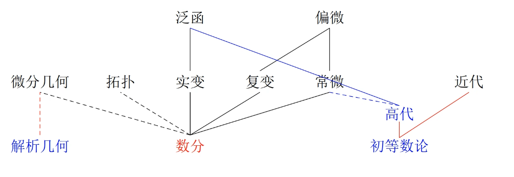
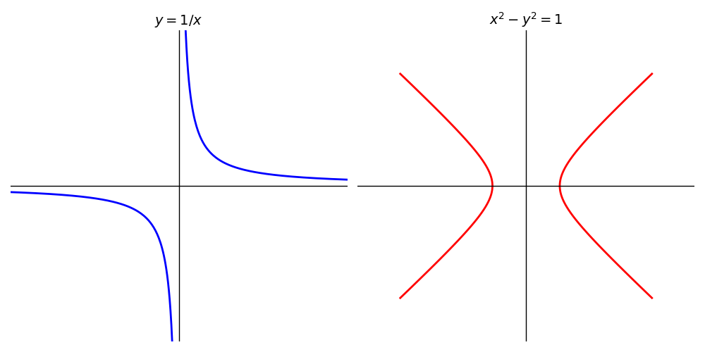
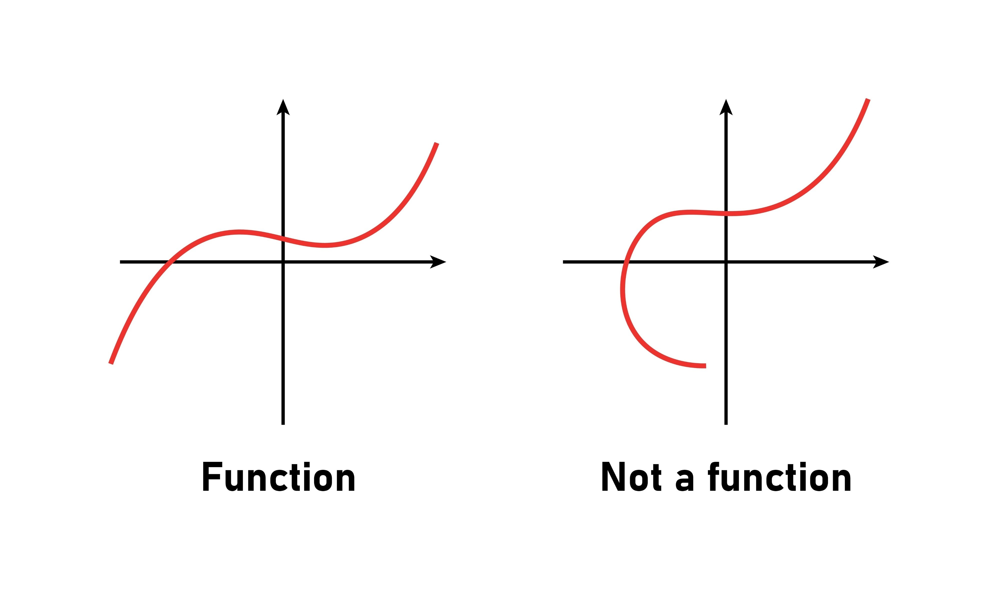
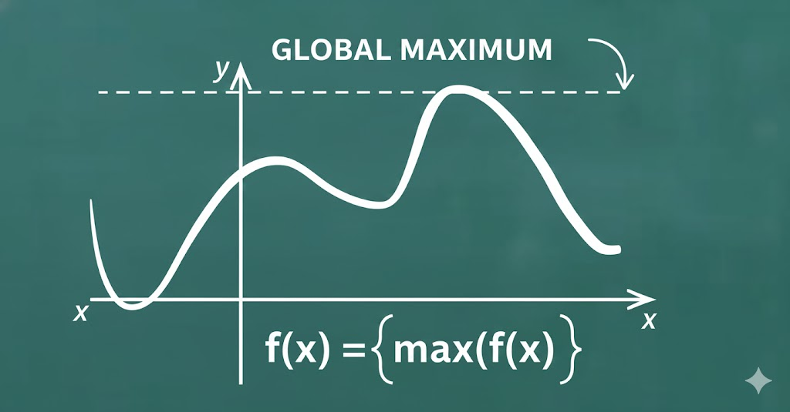

[toc]

# 第一章   引入

把握住一个大原则：理解 > 运用 > 证明

## §1.  如何学数学

### 1.数学四大能力

（1）学数学四大能力

- 听解读写，即听课、解题、读书、写过程。
- 师范生还有一个：教，即教学。
- 研究生还有两个：作报告、与人交流。

（2）写过程

即写题目的解答、证明过程。要求是：有理有据、逻辑严谨、结构清晰。

（3）如何读书

本科阶段需掌握专业书籍的独立阅读能力，具体分为三个层次：
- 节级阅读：基础内容理解；
- 章级阅读：知识体系构建；
- 全书阅读：专业领域把握有效的阅读方法可显著提升学习兴趣与学术潜力。

（4）解题

解题三部曲

（5）听课

- 听课目的优先级：
    - 最高级：培养独立思考能力。
    - 次高级：掌握学科思想方法。
    - 中级：构建知识结构。
    - 基础级：理解运用知识点。
    - 最低级：记忆知识点证明。
- 学习策略：优先掌握知识结构和思想方法，适当舍弃复杂证明，后期再针对性突破。
- 数学发展规律：学科知识是长期积累的结果，需避免急功近利的学习方式。

### 2.学习方法本质

（1）学习方法的本质是习惯，优秀的学习方法体现为良好的思维习惯，而低效方法则源于不良习惯。习惯的养成具有长期性。

（2）坏习惯难改的原因

- 认知缺失：无法意识到自身思维习惯存在问题；
- 改正阻力：缺乏正确方法论指导仍难以突破。

（3）正确认知的重要性

（4）建立正确认知是改变的前提。认知重构能降低习惯调整的难度。

（5）彻底摒弃旧有思维模式是掌握新方法的前提。

（6）好的学习方法难掌握的原因

优秀学习方法难以掌握的核心在于旧习惯的干扰，明确原理可帮助定位改进方向。

### 3.难掌握的根源

（1）根源

旧习惯的隐性影响。

（2）思维习惯更隐蔽

- 思维习惯比行为习惯更隐
	- 行为习惯（如左右手使用）可通过外部观察调整
	- 思维习惯无实体参照，干扰更难被察觉。

（3）坏习惯与做题经验对学习新方法的干扰

- 习惯性思维路径：用固有方法解题而忽略新方法演示；
- 经验主义误判：脱离上下文孤立理解新方法要点。需系统性训练才能克服干扰，典型改进周期可达数年。

### 4.如何掌握

（1）强化自我提醒，持续实践，进行推广、加强。

（2）做法

- 通过环境布置提醒自己
	- 电子设备桌面壁纸；
	- 手机日历设置多次提醒；
	- 环境高频刺激增加接触频次强化记忆。

（3）原理

记忆强化基于艾宾浩斯遗忘曲线原理：

- 重复间隔越短，记忆衰减速度越慢；
- 通过两分钟、五分钟、十分钟等递增间隔重复提醒可显著提升记忆效率；
- 高频密集提醒是形成长期记忆的关键。

（4）实践与反思：解题三步曲的应用与改进

- 出现问题后对照解题三部曲各版本反思原因
- 通过对比找出应用偏差并针对性改进
- 结合观察他人使用案例加速学习首次突破后需巩固成果，避免放弃。

（6）解题三部曲版本介绍

最简版可解决48%问题，完整版覆盖95%问题。

- 最简版是最容易的，一般人都能学会：因为没有任何分叉！
- 再往后是基础版，也比较容易，因为就只有两个分叉！
- 再往后是入门版，这个稍微麻烦点，虽然看上去有三个分叉，其实很多个小分叉！而且这个时候掌握不好不是出在方法本身，而是考验你的总结知识点 能力。

### 5.实践方法

（1）深信不疑

掌握方法的前提是深信其有效性，这比单纯改变观念更为关键。

（2）理解方法

- 分阶段学习：从最简版开始逐步深入，需重点理解方法原理与操作逻辑；
- 盲目使用的无效性：未理解直接应用将导致方法失效。

（3）九个自然问题烂熟于心并体会运用

- 记忆要求：九个自然问题需完全掌握，初期不熟悉可理解，但一周后仍不熟练则不合格
- 渐进式训练：先观察教师示范，再自主尝试组合运用
- 版本差异：不同版本的自然问题各有优劣，需通过实践体会适用场景
- 能力发展路径：从单一应用到组合应用，最终实现方法创新

(4）用心实践

- 实践必要性：方法价值通过高频实践体现，避免"看而不练"
- 专注度影响：用心程度与学习效果呈指数级关联
- 阶段性目标：初期重点攻克最简版，数分/高代等学科题目可侧重分析过程而非结果
- 资源利用：充分利用闲暇时间，题目筛选标准应匹配当前能力阶段

（5）反思

- 迭代精进：实践后需重新理解方法内涵，形成良性循环；
- 常见障碍：贪多求快、心态浮躁、题目超纲等均会影响效果；
- 能力隐形增长：短期内未见成效时需坚持，能力提升具有滞后性；
- 个性化指导：排除常规问题后仍无效者需针对性诊断。

### 6.四大方法的核心

（1）四大方法的核心：结构

听、读、写、解四大能力的本质共性在于结构，此为核心原则。教学实施同样遵循该逻辑。

（2）结构在课程设计中的应用

- 课程设计特征：每节课均存在明确主线结构，内容呈环环相扣关系
- 教学效果：清晰结构可降低学生理解难度，每个知识点的引入均有逻辑依据
- 容错机制：只要保持整体结构完整，局部细节偏差不影响教学有效性

## §2  大学基础数学课程结构

## §3  数学分析简介

### 1.基本信息

（1）别名

数学分析又称微积分，二者为同一学科的不同名称。

（2）内容

数学分析内容分为三部分：
- 一元微积分
- 多元微积分
- 级数理论

（3）起源

微积分起源于物理学与几何学。几何学领域主要贡献者为莱布尼茨，其核心思想是对切线与面积问题的推广。
- 切线问题：早期仅能求解圆和直线的切线，通过导数可推广至任意函数
- 面积问题：传统方法仅能计算规则图形面积，通过定积分可求解任意曲线围成区域的面积
### 2.微积分基本定理

微积分基本定理（牛顿-莱布尼茨公式）表述为：
若函数 $F(x)$ 的导数为 $f(x)$，则定积分

$$
\int ^a_b f(x)dx = F(b)-F(a)
$$

### 3.一元微积分整体内容

一元微积分体系可概括为"2、4、6、8 及 46 间关系"框架，其中六种函数构造方法为核心难点。

（1）六种构造

初等函数通过六种基本运算构造：
- 四则运算（加、减、乘、除）；
- 复合运算；
- 反函数运算。

（2）四个概念

微积分包含四个核心概念：
- 微分与导数：两者等价，属于微积分的基础运算；
- 积分：与微分互为逆运算；
- 极限：微积分最核心的概念，贯穿大学半数以上数学内容；
- 连续：函数图像不断开的本质特征，区间上连续函数图像确实无间断。

（3）四六之间的关系

四个核心概念与六种运算构造的关系如下：

$$
\begin{aligned}
&\text{① 和差法则：} && (f \pm g)' = f' \pm g' \\
&\text{② 乘法法则：} && (fg)' = f'g + fg' \\
&\text{③ 除法法则：} && \left( \frac{f}{g} \right)' = \frac{f'g - fg'}{g^2} \\
&\text{④ 链式法则：} && [f(g)]' = f'(g) \cdot g' \\
&\text{⑤ 反函数法则：} && (f^{-1})' = \frac{1}{f'(f^{-1}(x))}=\frac{1}{f'}
\end{aligned}
$$

① 和差法则 （Sum and Difference Rule）

函数的和或差的导数等于各函数导数的和或差。
$$
(f \pm g)' = f' \pm g'
$$

② 乘法法则 （Product Rule / Leibniz Rule）

两个函数乘积的导数遵循“前导后不导，加，后导前不导”。

$$
(fg)' = f'g + fg'
$$

③ 除法法则 （Quotient Rule）

两个函数商的导数公式中，分母为原分母的平方。

$$
\left( \frac{f}{g} \right)' = \frac{f'g - fg'}{g^2}
$$

④ 复合函数求导 （Chain Rule）

即复合函数 $f(g(x))$ 的导数，遵循“由外向内”逐层求导。

$$
(f(g))' = f'(g) \cdot g'
$$

注：这里 $f'(g)$ 表示 $f$ 对其中间变量 $g$ 的导数。

⑤ 反函数求导 （Inverse Function Rule）

若 $f^{-1}$ 是 $f$ 的反函数，其导数等于原函数导数的倒数。

$$
(f^{-1})' = \frac{1}{f'(f^{-1})}=\frac{1}{f'}
$$

极限、连续、积分与六种构造同样存在类似关系

（4）微积分两大核心思想

- 逼近：极限是逼近思想的严格数学表达，贯穿分析学始终；
- 代换：将复合函数转化为简单函数，便于分析极限、导数等性质。

（5）八个定理

八个定理对应四个核心概念：
- 极限：2 个定理
- 连续：2 个定理
- 导数/微分：3 个定理
- 积分：1 个定理（牛顿-莱布尼茨公式）

（6）微积分为核心的原因

微积分以极限而非微分为核心存在历史原因，具体渊源需通过微积分发展史阐释

## §4  微积分小史

微积分的历史可分为四个阶段：
- 早期：微积分的产生阶段；
- 严格化时期：早期理论存在不严格性，需进一步严密化；
- 实数理论：为微积分奠定更坚实的基础；
- 后续发展：微积分的扩展与应用。

### 1.早期（1684年之前——1783年）

起源于物理学与几何学。

- 微积分起源于物理学与几何学，几何学关注曲线下面积的求解问题。
- Newton，Leibniz 分别独立发展了微积分，但 Leibniz 于1684年首次发表相关论文，标志着微积分的正式诞生。
- Newton 的发现早于 Leibniz 约十年，但未及时发表。
- Leibniz 学派在早期发展中占据主导地位，代表人物包括 Bernoulli 兄弟及其学生Euler。
- Euler（1707-1783）是历史上首次引入函数概念的数学家，并将分析学定义为研究函数及其性质的学科。
- 早期微积分的证明依赖几何直观，缺乏严格性。

### 2.严格化（1784年——1870年左右）

（1)）起因

- 早期微积分的不严格性主要体现在对“无穷小量”的使用上，其定义模糊（既为零又非零），引发数学界的质疑。
- 第二次数学危机由此产生，与第一次数学危机（无理数的发现）类似。
- 达朗贝尔、拉格朗日等数学家尝试挽救微积分基础，但均未成功。

（2）Cauchy是分析严格化的第一人

- Cauchy 于1820年左右将微积分建立在极限理论之上，解决了无穷小量的矛盾。
- Cauchy 的贡献包括用极限重新证明微积分核心定理，但仍存在三个未解决的问题：
    - 极限定义的不严格性;
    - 循环论证问题（极限依赖于实数，而实数定义又依赖极限）。
- Weierstrass 进一步完善极限的严格定义，被称为现代分析之父。
### 3.实数理论

（1）起因

Cauchy 意识到其极限理论依赖实数，但实数的定义（尤其是无理数）本身依赖极限过程，导致循环论证。

（2）1872年

数学家（如 Meray、Heine、Cantor）提出解决方案：Cantor 用有理数的 Cauchy 序列定义无理数，避免极限依赖。

（3）Dedekind

Dedekind 通过有理数的分割引入无理数，彻底解决循环论证问题。

实数理论为微积分提供了严格的底层基础，但学习难度较高。
### 4.后续

- 微积分后续发展包括多元微积分、实变函数等分支。
- 实变函数工具极大简化了传统微积分中的复杂证明。

### 5.学习数学史的重要性：
- 理解概念提出的背景与脉络（如为什么需要实数理论）。
- 避免对学科发展的错误认知（如“快速掌握”违背历史规律）。
- 通过历史故事增强学习兴趣（如数学家间的争论与合作）。

## §5  数学分析常用的高中知识

### 1.各种函数及性质

（1）幂函数

$x^n, n \in \mathbb{N}$，尤其 $n = 1, 2, 3, -1$。

（2）指数函数

$y = a^x, a > 0$ 且 $a \neq 1$。
当 $a > 1$ 时严格单调递增；
当 $0 < a < 1$ 时严格单调递减。

（3）对数函数

$y = \log_a x, a > 0$ 且 $a \neq 1$。

- **定义域**为 $(0, +\infty)$；
- 与指数函数 $y = a^x$ **互为反函数**；
- 当 $a > 1$ 时严格单调递增；当 $0 < a < 1$ 时严格单调递减。

（4）三角函数

- **六个**：$\sin x$；$\cos x$；$\tan x = \dfrac{\sin x}{\cos x}$；$\cot x = \dfrac{\cos x}{\sin x}$；$\sec x = \dfrac{1}{\cos x}$；$\csc x = \dfrac{1}{\sin x}$。
  
- **定义域**：$\mathbb{R}$；……
  
- **单调区间**：$[2k\pi - \frac{\pi}{2}, 2k\pi + \frac{\pi}{2}]$ 单增，$[2k\pi + \frac{\pi}{2}, 2k\pi + \frac{3\pi}{2}]$ 单减，$k \in \mathbb{Z}$；……
  
- **周期性**：$2\pi$ 最小正周期；……
  
- **零点**：$k\pi, k \in \mathbb{Z}$；……
  
- **加法公式**：$\sin(a + b) = \sin a \cos b + \sin b \cos a$；……

### 2.不等式

（1）四则运算

- **加减法**：不等式两边同时加减一个数不改变不等号；
- **乘法**：设 $x < y$，如果 $a > 0$ 则 $ax < ay$，如果 $a < 0$ 则 $ax > ay$；
- **除法**：乘法的逆运算！

（2）基本不等式

- **形式**：$a^2 + b^2 \geqslant 2ab$；
- **证明**：将 $(a - b)^2 \geqslant 0$ 展开移项。

（3） Cauchy 不等式

- **形式**：$(a_1^2 + a_2^2 + a_3^2)(b_1^2 + b_2^2 + b_3^2) \geqslant (a_1b_1 + a_2b_2 + a_3b_3)^2$；
- **理解**：向量 $|\vec{a}| \cdot |\vec{b}| \geqslant |\vec{a} \cdot \vec{b}|$，其中 $\vec{a} = (a_1, a_2, a_3), \vec{b} = (b_1, b_2, b_3)$。

（4）.用单调性

如 $2^x$ 在 $\mathbb{R}$ 上严格单调递增，从而对任意的 $a < b$，有 $2^a < 2^b$。

### 3.多项式定理

（1）形式

$$
(a+b)^n = \sum_{k=0}^{n} C_n^k a^k b^{n-k}
$$

（2）示例

- $(a+b)^3 = a^3 + 3a^2b + 3ab^2 + b^3$
- $(a+b)^4 = a^4 + 4a^3b + 6a^2b^2 + 4ab^3 + b^4$
  

（3） 注

- 是否有人好奇这一个定理怎么能和前面两类系统知识平起平坐？
- 事实上，Newton 在数学上的第一桶金正是把这个二项式定理推广到 $(a+b)^{\frac{n}{m}}, n, m \in \mathbb{N}$ 的形式。当 $m=1$ 时就是二项式定理。
- 再后来，Newton 用他的这种推广的二项式定理窥探到微积分的很多奥秘！

## §6  描述问题

### 1.重要性

描述其实就是把你的感觉、想法表达清楚。

- 描述问题的核心障碍在于无法将感觉转化为文字或数学符号。
- 描述能力影响解题效率，部分题目因表述不清而难以解决。
- 描述能力提升思考与交流，尤其在学术研究中至关重要。
- 阿贝尔的历史经验（“要把数学问题描述成最有利于它解决的形式”）强调将问题描述为最利于解决的形式。

理解的逆过程
理解＞运用，证明！

### 2.如何描述

（1）文字描述

第一步：用自然语言清晰表达感觉或想法。

（2）数学描述

第二步：将文字描述转化为精确的数学语言（符号或公式）。

（3）证明

第三步：验证数学描述的正确性，感觉可能错误需通过证明修正。
反复调整：若证明失败，需重新描述并重复上述步骤。

描述能力与理解能力互为逆过程：
理解是将数学语言转化为文字表述，而描述则是将文字表述转化为数学语言。
提升描述能力可直接增强对数学概念的理解深度。

### 3.文字描述感觉

（1）逐步逼近

文字描述感觉的方法论：
- 分步描述法：优先表述最易定义的部分（如"最大值"中的"最大"可描述为"函数值均≤M"），再逐步补充必要条件（如需增加"存在x₀使f(x₀)=M"以排除反例）。
- 整体描述法：直接使用"值域中的最大元"或"所有函数值中的最大者"等完整表述，但需建立在已掌握分步逻辑的基础上。
- 核心原则：避免一步到位思维，应采用渐进策略，通过持续练习提升描述精度。

> 以 “**最大值 $M$**” 为例：
>
> - 比较容易的是 “**最大**”：函数值都小于等于 $M$。这够不够？不够，如 $\sin x \le 2$，而最大值是 $1$。原因何在？**取不到！**
> - **取到**：函数值能取到 $M$。
>
> > 注：
> > 当然感觉好的还有其它的描述：“所有值中最大的”、“函数值中最大的”、“值域的最大元”！

（2） 特殊的

特殊案例归纳法适用于复杂概念描述：
- 以方程求根公式为例，通过分析二次、三次方程求根公式的结构特征（如嵌套根式），归纳"根式可解"的普遍定义。
- 关键认知：阿贝尔突破性在于将问题转化为可描述形态，而非单纯计算能力。
- 学习建议：
    - 避免过早查阅答案，需保持独立思考至少5分钟；
    - 抽象代数概念（如伽罗瓦理论）的理解需前置知识积累，强行接触易导致认知混乱；
    - 数学能力与院校背景无必然关联，核心在于思维方法的系统训练。

> 如 “**根式可解**”：
>
> - 二次方程：$ax^2 + bx + c = 0, x = \dfrac{-b \pm \sqrt{b^2 - 4ac}}{2a}$；
>   
> - 三次方程：$ax^3 + bx^2 + cx + d = 0, x = u - \dfrac{p}{3u} - \dfrac{b}{3a}$，
>     其中 $u = \sqrt[3]{-\dfrac{q}{2} + \sqrt{(\dfrac{q}{2})^2 + (\dfrac{p}{3})^3}}$，且 $p = \dfrac{3ac - b^2}{3a^2}, q = \dfrac{2b^3 - 9abc + 27a^2d}{27a^3}$。

### 4.文字描述翻译成数学描述

（1）原则

逐句按照从左到右的顺序翻译！再按数学表达习惯调整。【英语翻译很像】

文字转数学描述的双阶段法则：

- 逐词直译阶段：
  - 按语序翻译每部分（如"$函数值≤M$"对应"$∀x∈X,f(x)≤M$"）；
  - 暂存无法直接转换的表述（如"中最大的"需结合上下文推断为"$∃x_0∈X$"）。
- 数学规范化阶段：
  - 调整语序符合数学惯例（如将存在量词置于任意量词后）；
  - 验证逻辑完整性（如最大值定义需同时包含"$∀f(x)≤M$"与"$∃f(x₀)=M$"）。
- 类比迁移：该过程与英语翻译的语序调整机制具有方法论一致性。

（2）示例

最大值的各种描述：

- 先逐句按照从左到右的顺序翻译：
  
    (i) 最大：函数值都小于等于 $M$；取到：函数值能取到 $M$。$f(x), \forall \leqslant M$；$\exists x_0 \in X$ 使得 $f(x_0) = M$。
    
    (ii) “所有值中最大的”：“所有” $\forall$；“值”是什么值？函数值 $f(x)$；“中”：不好翻译，先放一下；最大的：$\leqslant *$；结合“中”：$* = f(x_0)$。
    
    (iii) “函数值中最大的”、“值域的最大元”：基本上同上。
    
- 再按数学表达习惯调整： 对 $\forall x \in X$ 有 $f(x) \leqslant M$ 且 $\exists x_0 \in X$ 使得 $f(x_0) = M$。

## §7  最值

### 1.函数

（1）理解函数与曲线的差异

反比例函数与双曲线

（2）定义

- 函数定义的三要素：给定两个非空实数集 $X$（定义域）和 $Y$（值域），以及对应法则 $f$。
- 符号表示：函数记作 |
  $$
  f:X→Y，x↦y, \tag{*}
  $$
  其中 $x∈X$，存在唯一的 $y∈Y$ 使得 $y=f(x)$。
- 定义域与值域：集合 $X$ 称为函数的定义域，集合 $Y$ 称为函数的值域。
- 函数值的表示：$y$ 称为函数 $f$ 在 $x$ 处的函数值，$x$ 称为自变量，$y$ 称为因变量。

（3）注

① （\*）中的 $f:X \to Y$ 强调的是数集 $X,Y$ 及它们之间的对应法则 $f$，$x \mapsto y$ 表示的是元素之间的对应关系，且称 $y$ 为 $f$ 在 $x$ 的函数值，且称 $x$ 为自变量，$y$ 为因变量；
② 由于 $Y \subset R$ ，从而函数三要素 $X,Y,f$ 划为两个：$X,f$，因此常将函数写成 $f:X\to Y$；
③ 相等：$f,g$ 相等 $\Longleftrightarrow$ 定义域相同，且对应法则相同；
④ 同一函数可能有不同的表达式。
> $f:R \to R:x \mapsto |x|$；
> $f:R \to R:x \mapsto \sqrt{x^2}$。

### 2.定义

设函数 $f$ 定义在 $D$ 上。若 $\exists M \in \mathbb{R}$，使得

① 对 $\forall x \in D$ 有 $f(x) \leqslant M$ ，且
② $\exists\  x_0 \in D$ 使得 $f(x_0) = M$。

则称 $f$ 在 $D$ 上有最大值 $M$。

### 3. 理解

① 文字：函数值中最大的
② 几何：图像在 $y=M$ 下方且有交点

### 4.唯一性

性质： 设函数 $f$ 定义在 $D$ 上。若 $f$ 在 $D$ 上有最大值，则它的最大值是**唯一的**。

**注：** 证明唯一性有两种策略：

① 假设有两个值 $M_1, M_2$，再证 $M_1 = M_2$。
②反设有两个不相等的值 $M_1, M_2$，再推导出矛盾。

已知： $f$ 在 $D$ 上有最大值 $M_1, M_2$
求证： $M_1 = M_2$

根据最大值的定义，我们有以下三个条件：

① $\forall x \in D$，有 $f(x) \le M_1$ 且 $f(x) \le M_2$。
② $\exists\  x_1 \in D$，使得 $f(x_1) = M_1$。
③ $\exists\  x_2 \in D$，使得 $f(x_2) = M_2$。

代入未知

$$
M_1 \stackrel{\text{②}}{=} f(x_1) \underset{x_1 \in D}{\overset{\text{①后}}{\le}} M_2 \stackrel{\text{③}}{=} f(x_2) \stackrel{\text{①前}}{\le} M_1\\
$$
$$
M_2 \stackrel{\text{②}}{=} f(x_2) \underset{x_2 \in D}{\overset{\text{①后}}{\le}} M_1 \stackrel{\text{③}}{=} f(x_1) \stackrel{\text{①前}}{\le} M_2
$$

即 $M_1\leq M_2$ 且 $M_2 \leq M_1$，
即 $M_1 = M_2$

### 5.否定

## 解题三部曲：最简版

### 1. 内容

（1）已知：列出已知的条件；

（2）未知：列出待证的结论或待求的量；

（3）联系：建立已知与未知之间的联系。

注：

① 题目难度取决于建立联系的复杂性；
② 解题三部曲各版本的内涵相同，但建立联系的方式不同；
③ 适当引入一些符号、记号来表达已知、未知。

### 2. 如何建立联系

最简版：这等价于什么 / $\iff$

### 3. 用法

（1）对已知、未知中不容易处理的**用**

（2）带入已知、未知（结合）

（3）检查条件

① 用 $B\Rightarrow$  未知时用 $A \Rightarrow B$ 检查 $A$ 成立？

② 分母不为 $0$。

> 示例：
>
> **例：** 证明 $f(x) = x^2$ 在 $[-2, 2]$ 上有最大值 $4$。
>
> **证：** 由于 $f(x) = x^2$ 定义在 $D = [-2, 2]$ 上，于是：
>
> ① 对 $\forall x \in D$ 有：$|x| \le 2$，从而 $f(x) = x^2 = |x|^2 \le 2^2 = 4$；
>
> ② $\exists\  x_0 = 2 \in D$ 使得 $f(x_0) = x_0^2 = 2^2 = 4$
>
> $\therefore$ 由最大值的定义知：$\dots \dots$
