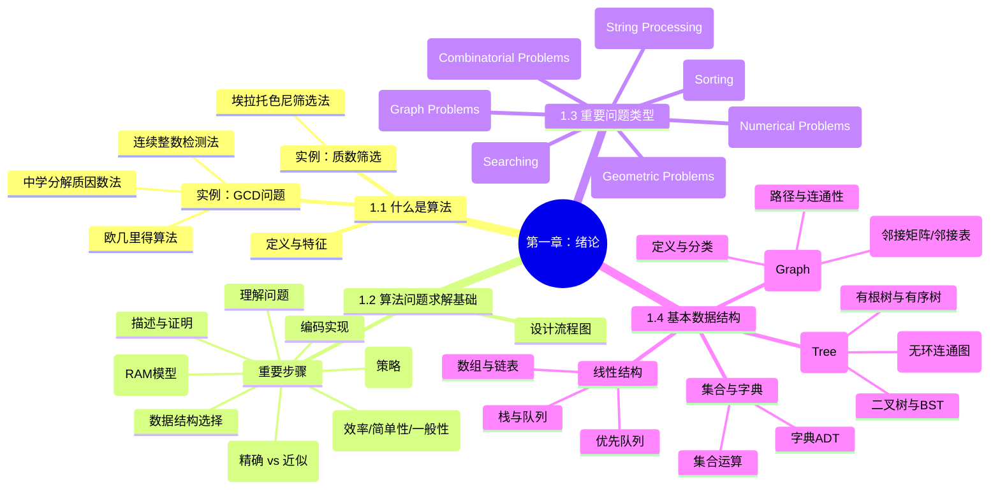

这是一份基于《算法设计与分析基础（第3版）》第一章的详细读书笔记。笔记旨在梳理算法的基本概念、设计流程、核心问题类型及基础数据结构，适合作为复习和知识框架构建的参考。

---

### 📚 第一章：绪论 (思维导图)



---


$$
\text{第一章：绪论}
\begin{cases}
\text{1.1 什么是算法} 
    \begin{cases} 
    \text{定义与特征} \\
    \text{实例：GCD问题} 
        \begin{cases} 
        \text{欧几里得算法} \\
        \text{连续整数检测法} \\
        \text{中学分解质因数法}
        \end{cases} \\
    \text{实例：质数筛选} \to \text{埃拉托色尼筛选法}
    \end{cases} \\[1em]

\text{1.2 算法问题求解基础} 
    \begin{cases} 
    \text{设计流程图} \\
    \text{重要步骤} 
        \begin{cases} 
        \text{理解问题} \\
        \text{了解设备能力 (RAM模型)} \\
        \text{解法选择 (精确 vs 近似)} \\
        \text{设计技术 (策略)} \\
        \text{数据结构选择} \\
        \text{描述与证明} \\
        \text{分析 (效率/简单性/一般性)} \\
        \text{编码实现}
        \end{cases}
    \end{cases} \\[1em]

\text{1.3 重要问题类型} 
    \begin{cases} 
    \text{排序 (Sorting)} \\
    \text{查找 (Searching)} \\
    \text{字符串处理 (String Processing)} \\
    \text{图问题 (Graph Problems)} \\
    \text{组合问题 (Combinatorial Problems)} \\
    \text{几何问题 (Geometric Problems)} \\
    \text{数值问题 (Numerical Problems)}
    \end{cases} \\[1em]

\text{1.4 基本数据结构} 
    \begin{cases} 
    \text{线性结构} 
        \begin{cases} 
        \text{数组与链表} \\
        \text{栈与队列} \\
        \text{优先队列}
        \end{cases} \\
    \text{图 (Graph)} 
        \begin{cases} 
        \text{定义与分类} \\
        \text{表示法 (邻接矩阵/邻接表)} \\
        \text{路径与连通性}
        \end{cases} \\
    \text{树 (Tree)} 
        \begin{cases} 
        \text{定义 (无环连通图)} \\
        \text{有根树与有序树} \\
        \text{二叉树与BST}
        \end{cases} \\
    \text{集合与字典} 
        \begin{cases} 
        \text{集合运算} \\
        \text{字典ADT}
        \end{cases}
    \end{cases}
\end{cases}
$$


### 📝 详细笔记内容

#### 1.1 什么是算法 (What is an Algorithm?)

**1. 定义**

* 算法是一系列解决问题的明确指令，对于符合一定规范的输入，能够在有限时间内获得要求的输出 。


* 算法并不依赖于计算机，但现代算法主要由计算机执行 。


**2. 算法的特性（通过最大公约数 GCD 问题展示）**
同一个问题可以用多种不同的算法解决，其思路、复杂度和效率各不相同 。

* **欧几里得算法 (Euclid's Algorithm):**
* 基于原理： 。


* 步骤：重复用  除  取余，直到余数为0 。


* 特点：历史悠久，效率高，步骤明确。


* **连续整数检测算法:**
* 思路：从  开始递减检测，找到第一个能同时整除  和  的数 。


* 缺陷：当输入为0时需额外处理，效率较低 。


* **中学分解质因数法:**
* 步骤：分别找出  和  的质因数，找出公共质因数并相乘 。


* 缺陷：步骤描述不够形式化（如“找到所有质因数”未定义具体操作），比欧几里得算法复杂且慢 。


**3. 埃拉托色尼筛选法 (Sieve of Eratosthenes)**

* 用于生成不大于  的连续质数序列 。


* **核心思想:** 初始化  的列表，重复消去当前数字的倍数。
* 
**优化:** 外层循环只需进行到 ，因为更大的合数必然包含小于等于  的因子 。


---

#### 1.2 算法问题求解基础 (Fundamentals of Algorithmic Problem Solving)

**1. 算法设计的一般过程**
算法不仅仅是代码，而是获得答案的精确过程。设计过程包含一系列典型步骤 ：

1. 
**理解问题:** 明确输入范围、边界情况，必要时手工模拟 。


2. 
**了解计算设备:** 绝大多数基于 RAM (随机存取机) 模型，即指令顺序执行 。


3. **选择解法:**
* **精确算法:** 求得精确解。
* 
**近似算法:** 当精确解太慢或无法求得（如求平方根、非线性方程）时使用 。


4. 
**算法设计技术:** 使用通用的解题策略（如分治、贪婪等）指导设计，便于分类和研究 。


5. 
**确定数据结构:** 算法与数据结构密不可分（算法+数据结构=程序） 。


6. 
**描述算法:** 使用自然语言（由歧义）、伪代码（推荐，更精确）或流程图 。


7. 
**正确性证明:** 必须证明对所有合法输入都能在有限时间内输出正确结果，常用数学归纳法 。


8. **分析算法:**
* 
**效率:** 时间效率（速度）和空间效率（内存） 。


* 
**简单性:** 易于理解和实现，bug 更少 。


* 
**一般性:** 能够处理更广泛的问题或输入 。


9. 
**编写代码:** 包含测试、调试及代码优化（如将循环内不变式外提） 。


**2. 核心观点**

* 好的算法往往是反复修正的结果 。


* 并非所有问题都有算法解（如不可判定问题） 。


---

#### 1.3 重要的问题类型 (Important Problem Types)

**1. 排序 (Sorting)**

* 目的：按升序排列数据，常作为查找或其他算法的预处理 。


* 特性：
* 
**稳定性 (Stable):** 保留等值元素的相对顺序 。


* 
**在位性 (In-place):** 不需要额外的存储空间 。


* 现状：基于键值比较的排序算法，最少约需  次比较 。


**2. 查找 (Searching)**

* 在集合中寻找给定值（查找键）。
* 动态查找：涉及频繁的添加和删除操作，需平衡查找与维护数据结构的代价 。


**3. 字符串处理 (String Processing)**

* 涉及文本、位串、基因序列等。
* 核心问题：字符串匹配（在文本中查找单词） 。


**4. 图问题 (Graph Problems)**

* 应用：交通、通信、社交网络。
* 基本算法：遍历、最短路径、拓扑排序 。


* 困难问题：旅行商问题 (TSP)、图填色问题（通常难以高效求解） 。


**5. 组合问题 (Combinatorial Problems)**

* 寻找满足特定性质的排列、组合或子集。
* 难点：随着规模增大，组合对象数量呈指数级增长，往往是计算领域最难的问题 。


**6. 几何问题 (Geometric Problems)**

* 处理点、线、面等几何对象。
* 经典问题：最近对问题、凸包问题 。


**7. 数值问题 (Numerical Problems)**

* 涉及连续数学问题（解方程、积分）。
* 难点：实数的近似表示和舍入误差累积 。


---

#### 1.4 基本数据结构 (Fundamental Data Structures)

**1. 线性数据结构**

* 
**数组 (Array):** 连续存储，通过下标在常量时间内随机访问 。


* 
**链表 (Linked List):** 节点通过指针链接，插入删除效率高，但访问需遍历。包括单链表、双链表 。


* 
**列表 (List):** 抽象结构，包括栈和队列 。


* 
**栈 (Stack):** 后进先出 (LIFO)，用于递归 。


* 
**队列 (Queue):** 先进先出 (FIFO)，用于图算法 。


* 
**优先队列 (Priority Queue):** 按优先级出队，通常用堆 (Heap) 实现 。


**2. 图 (Graph)**

* 
**定义:** ，由顶点集合  和边集合  组成 。


* **分类:**
* 无向图 vs 有向图 (Digraph) 。


* 稀疏图 vs 稠密图 。


* 加权图 (Weighted Graph): 边带有权重或成本 。


* **表示法:**
* 
**邻接矩阵:**  布尔矩阵（或权重矩阵），适合稠密图 。


* 
**邻接链表:** 顶点及其邻接点的列表，适合稀疏图 。


* **概念:**
* 路径 (Path): 邻接顶点序列。
* 连通性 (Connectivity): 任意两点间存在路径。
* 回路 (Cycle): 起点终点相同的路径。无环图 (Acyclic) 不包含回路 。


**3. 树 (Tree)**

* 
**定义:** 连通无回路图。边数  。


* 
**森林:** 无回路但不一定连通的图 。


* 
**有根树 (Rooted Tree):** 指定一个顶点为根，形成层级关系（祖先、父母、子女、兄弟、叶节点） 。


* 
**二叉树 (Binary Tree):** 每个节点最多两个子女（左/右）。高度  满足  。


* 
**二叉查找树 (BST):** 左子树值 < 父母值 < 右子树值 。


* 
**表示法:** 常用左指针指向第一个子女，右指针指向下一个兄弟（先子女后兄弟表示法） 。


**4. 集合与字典 (Sets & Dictionaries)**

* 
**集合:** 互不相同项的无序组合。可用位向量或列表实现 。


* 
**字典:** 实现查找、增加、删除操作的数据结构 。


* 
**ADT (抽象数据类型):** 数据对象集合及对其操作的定义，如优先队列和字典 。


---

### 💡 总结与建议

本章作为全书的导引，建立了算法的形式化定义，并强调了**算法设计技术**（策略）的重要性。对于备考研究生考试，建议重点掌握：

1. **欧几里得算法**的原理及递归性质。
2. **图的表示方法**（邻接矩阵 vs 邻接表）及其适用场景。
3. **树的性质**，特别是二叉树的高度与节点数的关系（不等式）。
4. **算法效率分析**的基本概念（时间/空间/稳定性）。

**Next Step:** 您是否需要我针对本章的习题（如习题 1.1 中的欧几里得算法计算或习题 1.2 中的过桥谜题）提供详细的解答思路或模拟练习题？


# 《算法导论》第一章 绪论 - 详细笔记

## 思维导图
```
算法导论 第1章 绪论
├── 什么是算法
│   ├── 定义：解决问题的明确指令序列
│   ├── 特性：有限性、明确性、输入/输出
│   └── 例子：最大公约数的三种算法
│       ├── 欧几里得算法
│       ├── 连续整数检测算法
│       └── 质因数分解法(中学方法)
│           └── 埃拉托色尼筛选法
├── 算法问题求解基础
│   ├── 理解问题
│   ├── 了解计算设备性能
│   │   ├── 顺序算法(RAM模型)
│   │   └── 并行算法
│   ├── 精确解vs近似解
│   ├── 算法设计技术
│   ├── 确定适当的数据结构
│   ├── 算法的描述
│   │   ├── 自然语言
│   │   ├── 伪代码
│   │   └── 流程图(历史)
│   ├── 算法的正确性证明
│   ├── 算法的分析
│   │   ├── 效率(时间/空间)
│   │   ├── 简单性
│   │   └── 一般性
│   └── 为算法写代码
├── 重要的问题类型
│   ├── 排序
│   │   ├── 稳定性
│   │   └── 在位性
│   ├── 查找
│   ├── 字符串处理
│   ├── 图问题
│   ├── 组合问题
│   ├── 几何问题
│   └── 数值问题
└── 基本数据结构
    ├── 线性数据结构
    │   ├── 数组
    │   ├── 链表
    │   │   ├── 单链表
    │   │   └── 双链表
    │   ├── 栈(LIFO)
    │   ├── 队列(FIFO)
    │   └── 优先队列(堆实现)
    ├── 图
    │   ├── 表示方法
    │   │   ├── 邻接矩阵
    │   │   └── 邻接链表
    │   ├── 加权图
    │   └── 路径和环
    │       ├── 连通性
    │       └── 无环性
    ├── 树
    │   ├── 有根树
    │   │   ├── 祖先/子孙
    │   │   ├── 父母/子女
    │   │   └── 深度/高度
    │   ├── 有序树
    │   └── 二叉树
    │       ├── 二叉查找树
    │       └── 先子女后兄弟表示法
    └── 集合与字典
        ├── 位向量表示
        ├── 线性列表表示
        └── 抽象数据类型(ADT)
```

## 1. 什么是算法

### 1.1 定义与本质
- **算法**：一系列解决问题的明确指令，对于符合规范的输入，能在有限时间内获得要求的输出
- **本质**：算法是问题的程序化解决方案，不是答案本身，而是获得答案的精确指令
- **重要性**：算法与微积分并列为两大思想宝石，算法造就了现代世界

### 1.2 算法的基本特性
- 每一步骤必须明确无歧义
- 需要明确定义输入的值域
- 同一问题可能存在多种不同算法
- 同一问题的不同算法可能基于完全不同的思路，效率也显著不同
- 应该明确终止条件，保证算法在有限步骤内结束

### 1.3 实例：计算最大公约数(GCD)的三种算法

#### 1.3.1 欧几里得算法
- **核心思想**：gcd(m, n) = gcd(n, m mod n)，直到m mod n = 0
- **时间复杂度**：O(log min(m, n))
- **伪代码**：
  ```
  算法 Euclid(m, n)
  while n ≠ 0 do
      r ← m mod n
      m ← n
      n ← r
  return m
  ```
- **优势**：效率高、历史悠久(两千多年前)、简洁优雅

#### 1.3.2 连续整数检测算法
- **核心思想**：从min{m, n}开始递减检查能同时整除m和n的最大整数
- **伪代码**：
  ```
  t ← min{m, n}
  while t ≥ 1 do
      if m mod t = 0 and n mod t = 0
          return t
      t ← t - 1
  ```
- **局限性**：对于大整数效率低，当输入包含0时需要特殊处理

#### 1.3.3 质因数分解法(中学方法)
- **核心思想**：找出m和n的所有质因数，然后计算公因数的乘积
- **辅助算法**：埃拉托色尼筛选法(生成质数序列)
  ```
  算法 Sieve(n)
  // 生成不大于n的所有质数
  for p ← 2 to n do A[p] ← p
  for p ← 2 to ⌊√n⌋ do
      if A[p] ≠ 0
          j ← p*p
          while j ≤ n do
              A[j] ← 0  // 标记为非质数
              j ← j + p
  // 将剩余元素复制到质数数组L中
  return L
  ```
- **局限性**：需要先解决质因数分解问题，效率较低

## 2. 算法问题求解基础

### 2.1 算法设计与分析过程
1. **理解问题**
   - 明确输入输出
   - 识别问题实例
   - 考虑边界情况
   - 手动解决小规模实例

2. **了解计算设备性能**
   - 顺序算法(类冯·诺依曼架构/RAM模型)
   - 并行算法(利用多处理器系统)
   - 考虑计算速度和存储容量限制

3. **在精确解法和近似解法之间做出选择**
   - 精确算法：提供准确解
   - 近似算法：在可接受误差范围内高效求解
   - 选择依据：问题性质、时间限制、精度要求

4. **算法设计技术**
   - 定义：解决多种计算问题的一般性方法
   - 重要性：
     - 为新问题提供指导
     - 为算法分类提供框架
   - 本书重点：基于设计技术组织内容

5. **确定适当的数据结构**
   - 数据结构与算法效率密切相关
   - "算法 + 数据结构 = 程序"
   - 选择依据：算法操作需求、效率要求

6. **算法描述方法**
   - 自然语言：易于理解但不够精确
   - 伪代码：平衡精确性和可读性
   - 流程图：历史方法，现代较少使用
   - 编程语言实现：最精确但依赖于具体语言

7. **算法正确性证明**
   - 证明对于所有合法输入，算法都能在有限时间内输出正确结果
   - 常用方法：数学归纳法
   - 近似算法：证明误差在预定义范围内

8. **算法分析**
   - **效率**：
     - 时间效率：衡量算法运行速度
     - 空间效率：衡量额外存储需求
   - **简单性**：
     - 易于理解和实现
     - 减少bug可能性
     - 美学价值
   - **一般性**：
     - 问题的一般性
     - 输入的一般性
   - 权衡：在多种特性间寻找平衡

9. **为算法写代码**
   - 挑战：正确性和效率
   - 验证方法：形式化证明(理论)和测试(实践)
   - 优化技巧：
     - 循环外计算不变式
     - 合并公共子表达式
     - 用低开销操作替代高开销操作
   - 经验分析：测量实际运行时间

### 2.2 核心原则
- **好的算法是不懈努力和反复修正的结果**
- **算法是最优的工程权衡**：在时间、空间、简单性、一般性之间寻找平衡
- **设计算法是一种创造性过程**：既有挑战又有乐趣

## 3. 重要的问题类型

### 3.1 排序问题
- **定义**：按升序重新排列给定列表
- **关键概念**：
  - 键(key)：排序依据
  - 稳定性(stability)：保持等值元素的相对顺序
  - 在位性(in-place)：是否需要额外存储空间
- **重要性**：
  - 本身是常见需求
  - 为其他操作(如查找)提供基础
  - 作为其他算法的辅助步骤

### 3.2 查找问题
- **定义**：在给定集合中找一个给定值
- **关键考虑**：
  - 静态vs动态数据(是否频繁增删)
  - 数据结构选择
  - 时间-空间权衡
- **常见算法**：顺序搜索、二分查找、哈希表等

### 3.3 字符串处理
- **定义**：处理字母表符号序列
- **常见问题**：字符串匹配
- **应用**：文本处理、编译器设计、生物信息学

### 3.4 图问题
- **定义**：处理顶点和边构成的网络
- **基本算法**：
  - 图遍历
  - 最短路径
  - 拓扑排序
- **困难问题**：
  - 旅行商问题(TSP)
  - 图着色问题

### 3.5 组合问题
- **定义**：寻找满足特定条件的组合对象(排列、组合、子集等)
- **挑战**：
  - 组合爆炸
  - 计算复杂性
- **多数情况下**：不存在高效精确解法

### 3.6 几何问题
- **定义**：处理点、线、多边形等几何对象
- **经典问题**：
  - 最近对问题
  - 凸包问题
- **应用**：计算机图形学、机器人技术、医学成像

### 3.7 数值问题
- **定义**：涉及连续数学问题的计算
- **挑战**：
  - 仅能近似求解
  - 舍入误差累积
- **典型问题**：解方程、计算积分、函数求值
- **历史地位**：曾是计算机科学核心，现仍重要但重心转移

## 4. 基本数据结构

### 4.1 线性数据结构
- **数组**
  - 连续存储，恒定时间访问
  - 适合实现字符串等结构
  
- **链表**
  - 节点+指针结构
  - 单链表：每个节点指向下一个元素
  - 双链表：每个节点指向前趋和后继
  - 优势：动态大小，高效插入/删除
  
- **栈(Stack)**
  - LIFO(后进先出)原则
  - 基本操作：push(入栈)、pop(出栈)
  - 应用：递归算法实现
  
- **队列(Queue)**
  - FIFO(先进先出)原则
  - 基本操作：enqueue(入队)、dequeue(出队)
  - 应用：广度优先搜索等
  
- **优先队列**
  - 操作：查找/删除最大元素，插入新元素
  - 高效实现：堆(heap)

### 4.2 图
- **定义**：G = <V, E>，V是顶点集，E是边集
- **类型**：
  - 无向图：边无方向
  - 有向图(digraph)：边有方向
  - 加权图：边有权重/成本
  
- **表示方法**：
  - 邻接矩阵：n×n布尔矩阵
  - 邻接链表：顶点邻接列表集合
  - 选择依据：稀疏图vs稠密图
  
- **重要概念**：
  - 路径：顶点序列
  - 简单路径：无重复顶点
  - 连通性：任意两顶点间存在路径
  - 环：起点终点相同的路径
  - 无环图：不包含任何环

### 4.3 树
- **定义**：连通无环图
- **性质**：|E| = |V| - 1
  
- **有根树**：
  - 选定根节点
  - 层次结构：根(0层)，子节点(1层)等
  - 关系：祖先/子孙，父母/子女，兄弟
  - 度量：深度(从根到节点的路径长度)，高度(最大深度)
  
- **二叉树**：
  - 每个节点最多两个子节点(左/右)
  - 二叉查找树：左子树值<父节点<右子树值
  - 高度性质：⌊log₂n⌋ ≤ h ≤ n-1
  - 先子女后兄弟表示法：将任意树转换为二叉树

### 4.4 集合与字典
- **集合**：互异元素的无序集合
  - 实现方式：
    - 位向量：适用于已知全集
    - 线性列表：更通用
  
- **字典**：支持三种操作的数据结构
  - 查找元素
  - 插入新元素
  - 删除元素
  
- **抽象数据类型(ADT)**
  - 定义：抽象对象集合+操作集合
  - 优势：封装数据与操作
  - 实现：面向对象语言中的类

## 关键总结

1. **算法本质**：精确、有限、明确的指令序列，解决特定计算问题
   
2. **设计过程**：理解问题→设计算法→证明正确性→分析效率→实现代码→优化改进
   
3. **算法权衡**：在效率、简单性、一般性之间寻找平衡，没有"完美"算法
   
4. **数据结构重要性**：合适的数据结构是高效算法的基础，"算法+数据结构=程序"
   
5. **问题分类**：排序、查找、字符串处理、图问题等类型构成了算法应用的主要领域
   
6. **历史与现实**：从欧几里得算法到现代应用，算法始终是计算机科学的核心

算法不仅是计算机科学的基石，更是解决问题的通用思维工具。正如克努特所言："尝试用算法将知识形式化，能使我们的理解更加深刻。"